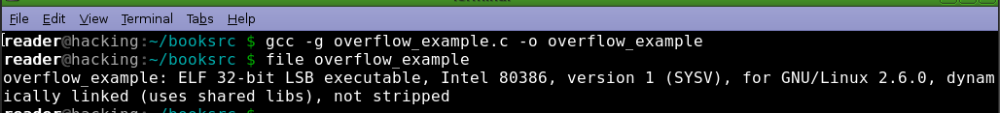
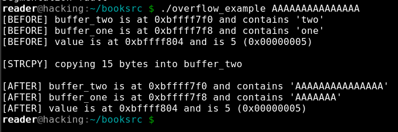

# Buffer Overflow
**A buffer overflow is a vulnerability that occurs when user input is passed into memory without verification if the size of input is equal or less than the size of the buffer allocated to him by the programmer.**

We gonna demonstrate the vuln using the `overflow_example.c` as example, this program only have the main function and is layed out like
`int value = 5;
`
`
char buffer_one[8], buffer_two[8];
`
`
strcpy(buffer_one, "one");
`
`
strcpy(buffer_two, "two");
`
and the program prints the location of `buffer_two` and `buffer_one` in memory and what it contains.

