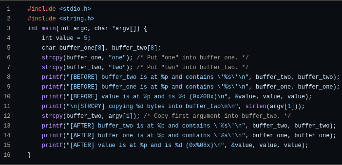
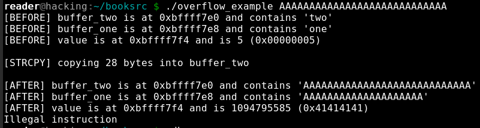
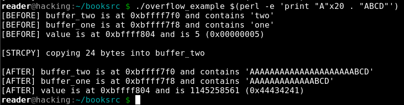
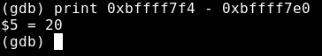
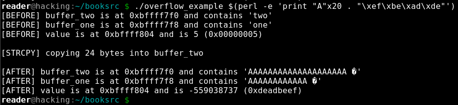

# Buffer Overflow
**A buffer overflow is a vulnerability that occurs when user input is passed into memory without verification if the size of input is equal or less than the size of the buffer allocated to him by the programmer.**

We gonna demonstrate the vuln using the `overflow_example.c` as example, this program only have the main function and is layed out like declaring an int variable, and two char buffers one after another.

and the program prints the location of `buffer_two` and `buffer_one` in memory and what it contains, both before and after the `line 12: strcpy(buffer_two, argv[1])`.

A compiled programs memory is divided into five segments: text, data, bss, heap, and stack. Each segment represents a special portion of memory that is set aside for a certain purpose.

The stack segment have variable size and is used as a temporary scratch
pad to store local function variables and context during function calls. When a program calls a function,
that function will have its own set of passed variables, and the function’s code
will be at a different memory location in the text (or code) segment. Since
the context and the EIP must change when a function is called, the stack is
used to remember all of the passed variables, the location the EIP should
return to after the function is finished, and all the local variables used by
that function. All of this information is stored together on the stack in what is
collectively called a stack frame. The stack contains many stack frames.

As the name implies, the stack segment of memory is, in fact, a stack data
structure, which contains stack frames. The ESP register is used to keep track
of the address of the end of the stack, which is constantly changing as items
are pushed into and popped off of it. Since this is very dynamic behavior, it
makes sense that the stack is also not of a fixed size. Opposite to the dynamic
growth of the heap, as the stack changes in size, it grows upward in a visual
listing of memory, toward lower memory addresses.

Because the stack is a FILO (first in, last out)type system, the first declared variables will be allocated first in the stack frame(bottom), and the lasted one in the topp, so even tho we only have access tho the lasted variables, we can overflow our input to leak to lower variables in the stack frame. So we can see that after `line 12:strcpy(buffer_two, argv[1]);` our input will overflow of the `buffer_two` to the addresses below him in the stack frame, thats it the variables declared before the `buffer_two`, even the `int value = 5` 

The family of x86 processors, including those from Intel and AMD, predominantly use little-endian byte ordering. Thats mean a byte-ordering scheme in which the least significant byte (the "little" end) of a multi-byte data value is stored at the lowest memory address. In other words, when we input a string into a buffer, lets say "ABCD" in the memory the first charachter stored is "D" then "C" etc...

So to control exactly how the data is stored inside some arbitrary memory address we use the little-endian byte ordering. Example writing `deadbeef` into the address `0xbffff7f4` of the `int value = 5;`, we need to calculate the distance between the address of the `buffer_two` where our input goes, and then write the payload using the least byte ordering

